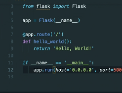
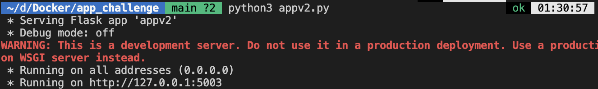
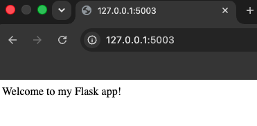
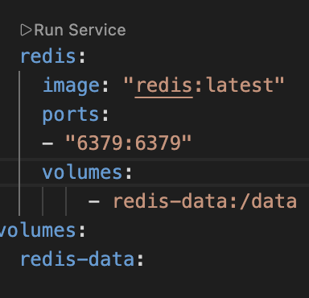
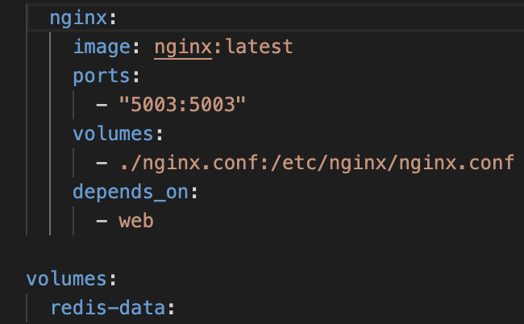
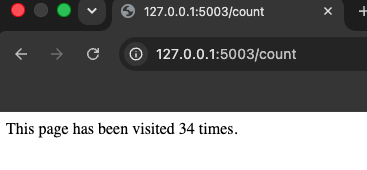

Docker Learning
# Docker Challenge: Flask + Redis Multi-Container Application

## Overview

This project is a multi-container application built as part of the CoderCo Containers Challenge, focused on containerisation and orchestration using Docker and Docker Compose.

The application consists of a Flask web app with two routes:

- a welcome page (`/`)
- a visit counter (`/count`)

Backed by Redis, which stores and persists the visit count. An Nginx reverse proxy sits in front of multiple scaled Flask instances, load balancing incoming traffic across them.

## Technologies Used

- **Python & Flask** - web framework serving the welcome route and visit counter route
- **Redis** - in-memory key-value store used to persist the visit count
- **Docker** - containerises the Flask app and Redis
- **Docker Compose** - defines, manages, and orchestrates the multi-container application, including environment variables, networking, and scaling
- **Nginx** - reverse proxy and load balancer, distributing traffic across scaled Flask instances

## Build Process

### Building the Flask Application

Started by writing `appv2.py` with two routes:

- `/` returns a welcome message
- `/count` connects to Redis, increments a counter, and displays the current visit count

Before containerising anything, I ran the app locally with `python3 appv2.py` to confirm the routes worked as expected.







### Dockerising Flask

Wrote a Dockerfile for the Flask app:

```dockerfile
FROM python:3.8-slim
WORKDIR /app
COPY . .
RUN pip install flask redis
EXPOSE 5003
CMD ["python", "appv2.py"]
```

Built and ran it standalone first to confirm the image worked before introducing Redis or Compose:

```
docker build -t flask-app .
docker run -d -p 5003:5003 flask-app
```

### Adding Redis

Rather than writing a custom Dockerfile for Redis, I referenced the official `redis:latest` image directly in `docker-compose.yml`, since Redis doesn't need any custom build steps.

### Configuring Docker Compose

Created `docker-compose.yml` to define both services together, letting Compose handle the networking so Flask could reach Redis by service name (`redis`) rather than an IP address.

Ran both services together with:

```
docker-compose up --build
```

## Additional Features

### Persistent Storage for Redis

By default, Redis data only exists for the lifetime of the container, restarting or rebuilding wipes the visit count. To fix this, I added a named Docker volume in `docker-compose.yml`, mounting it to `/data` inside the Redis container:

```yaml
redis:
  image: "redis:latest"
  ports:
    - "6379:6379"
  volumes:
    - redis-data:/data

volumes:
  redis-data:
```



This moves Redis's storage outside the container, so Docker manages it independently and the visit count survives container restarts and rebuilds.

While testing this, I initially ran `docker-compose down -v` to reset everything, which also wipes the volume itself, useful for a clean slate, but not for actually confirming persistence. To properly test that data survived a restart, I switched to `docker-compose down` (without `-v`) followed by `docker-compose up --build`, which stops and recreates the containers while leaving the named volume, and its data, intact.

### Environment Variables

Rather than hardcoding the Redis host and port inside `appv2.py`:

```python
r = redis.Redis(host='redis', port=6379)
```

I updated the code to read them from environment variables using Python's `os` module instead:

```python
redis_host = os.environ.get('REDIS_HOST', 'redis')
redis_port = int(os.environ.get('REDIS_PORT', 6379))
r = redis.Redis(host=redis_host, port=redis_port, db=0)
```

The actual values are then defined in `docker-compose.yml` under the `web` service, keeping configuration separate from code.

### Scaling with Nginx Load Balancing

To test scaling, I ran multiple instances of the Flask app:

```
docker-compose up --scale web=3 --build
```

Since only one container can bind to a host port at a time, running multiple Flask instances directly wasn't possible without a conflict. Nginx was introduced as a reverse proxy in front of the Flask service, listening on port 5003 and distributing incoming requests across all three Flask containers. Port exposure was removed from the Flask service entirely and moved to Nginx instead, so all external traffic enters through Nginx.

After scaling, `docker-compose up --scale web=3 --build` successfully created:

- `redis-1`
- `web-1`, `web-2`, `web-3`
- `nginx-1`

With Nginx routing traffic across all three Flask instances.





## Project Structure

```
app_challenge/
├── appv2.py
├── Dockerfile
├── nginx.conf
└── docker-compose.yml
```

A single Dockerfile builds the Flask app image. Nginx and Redis both run from their official Docker Hub images directly, no custom Dockerfile needed for either. `nginx.conf` is mounted into the Nginx container as a volume rather than baked into an image, so it can be edited without rebuilding anything. `docker-compose.yml` ties all three services together, defining the build context for Flask and the volume mounts for Nginx and Redis.

## What I Learned

- How Docker Compose networking allows containers to reach each other by service name, without needing to manually create a custom Docker network like I had to for a previous MySQL-based project
- How to move configuration (Redis host/port) out of application code and into environment variables, keeping the codebase portable across environments
- Why scaling a service means running multiple containers from the same image, and why a reverse proxy is necessary once more than one container needs to share a single entry point
- The difference between building a custom image (Flask) versus referencing an official pre-built image directly (Redis, Nginx), and when each approach is appropriate

